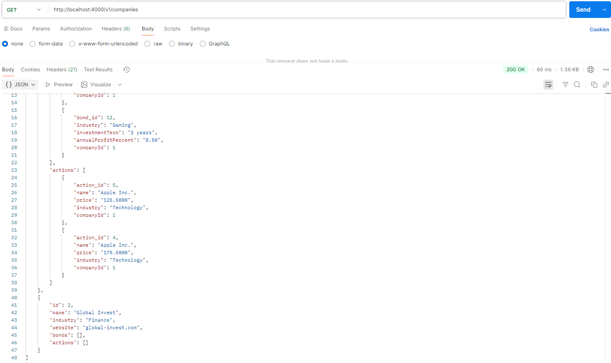
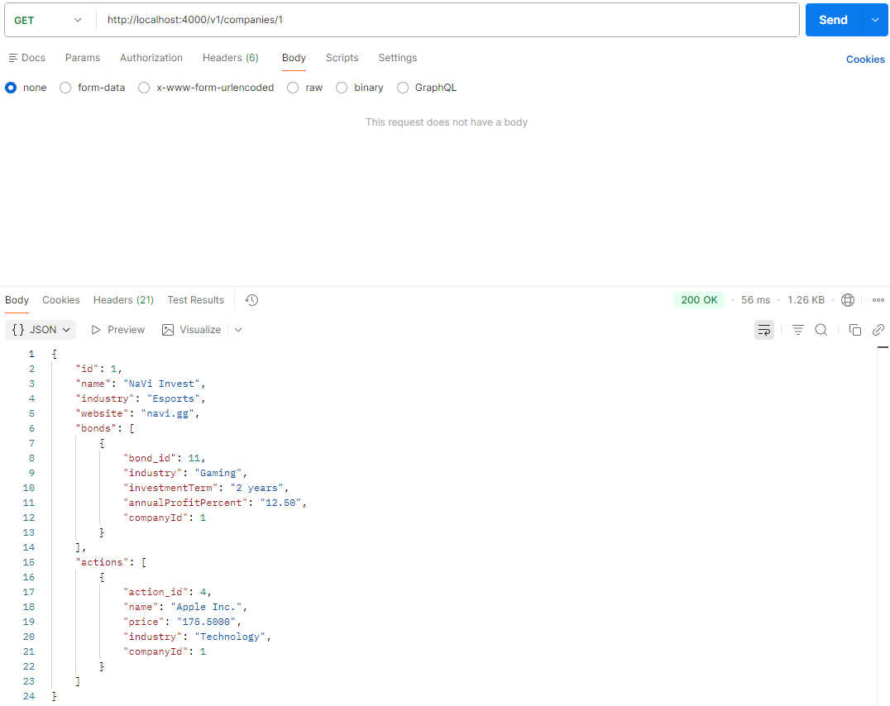
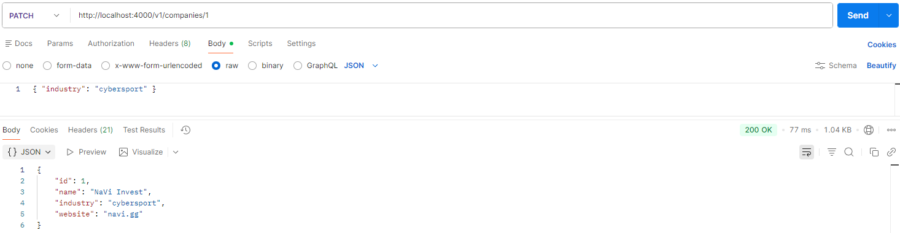
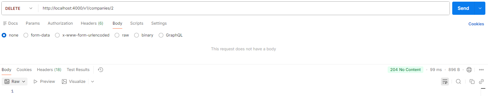
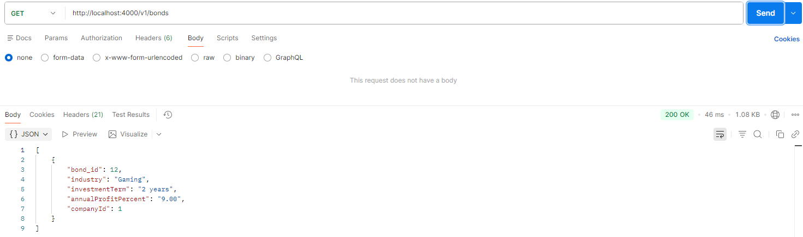
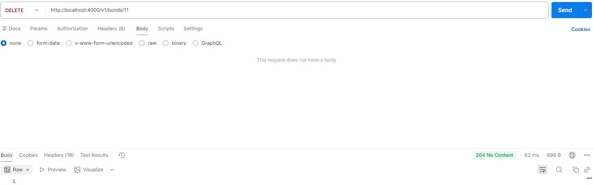
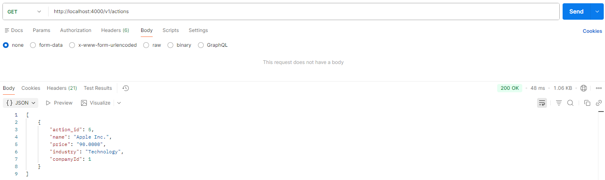

# Лабораторно-практична робота №5

## Розширення бекенд-додатку власними сутностями та реалізація REST API
### Мета
Розвинути навички проектування та реалізації серверної логіки, інтегрувавши проєкт бази даних з курсової роботи у повноцінний бекенд-додаток. Навчитись створювати пов'язані сутності за допомогою TypeORM, керувати структурою БД через міграції та будувати REST API для роботи з реляційними даними.

## 1. Короткий опис реалізованих сутностей та їхніх зв'язків
Company (Компанія) - головна сутність, має свої акції та облігації.

Bond (Облігація) - фінансовий актив, прив'язаний до конкретної компанії.

Action (Акція) - фінансовий актив, прив'язаний до конкретної компанії.

Різниця в акціях та облігаціях в їх полях та тому як вони працюють в інвест компанії.

## 2. Перелік реалізованих API ендпоінтів
### Управління компаніями
GET /companies - Отримати список усіх компаній зі звітами по активах.

GET /companies/:id - Детальна інформація про конкретну компанію та активи, що вона пропонує.

POST /companies - Реєстрація нової інвестиційної компанії.

PATCH /companies/:id - Оновлення даних компанії.

DELETE /companies/:id - Видалення компанії (заблоковано, якщо є активи, спочатку треба видалити їх).

### Управління облігаціями
GET /bonds - Список усіх облігацій у системі.

POST /bonds - Створення нової облігації з прив'язкою до companyId.

PATCH /bonds/:id - Редагування параметрів.

DELETE /bonds/:id - Видалення облігації.

### Управління акціями
GET /actions - Список усіх доступних акцій.

POST /actions - Додавання нової акції.

PATCH /actions/:id - Оновлення акції.

DELETE /actions/:id - Видалення акції з бази.

## 3. Скріншоти з Postman
### Компанії
Створення нової компанії

Список усіх компаній та активів, що вони пропонують

Переглянути компанію за id та активи, що вона пропонує

Оновити компанію

Видалити компанію

### Облігації
Додати нову облігацію

Список усіх облігацій

Оновити облігацію за id

Видалити облігацію за id

### Акції
Додати нову акцію

Список усіх акцій

Оновити акцію за id

Видалити акцію за id

