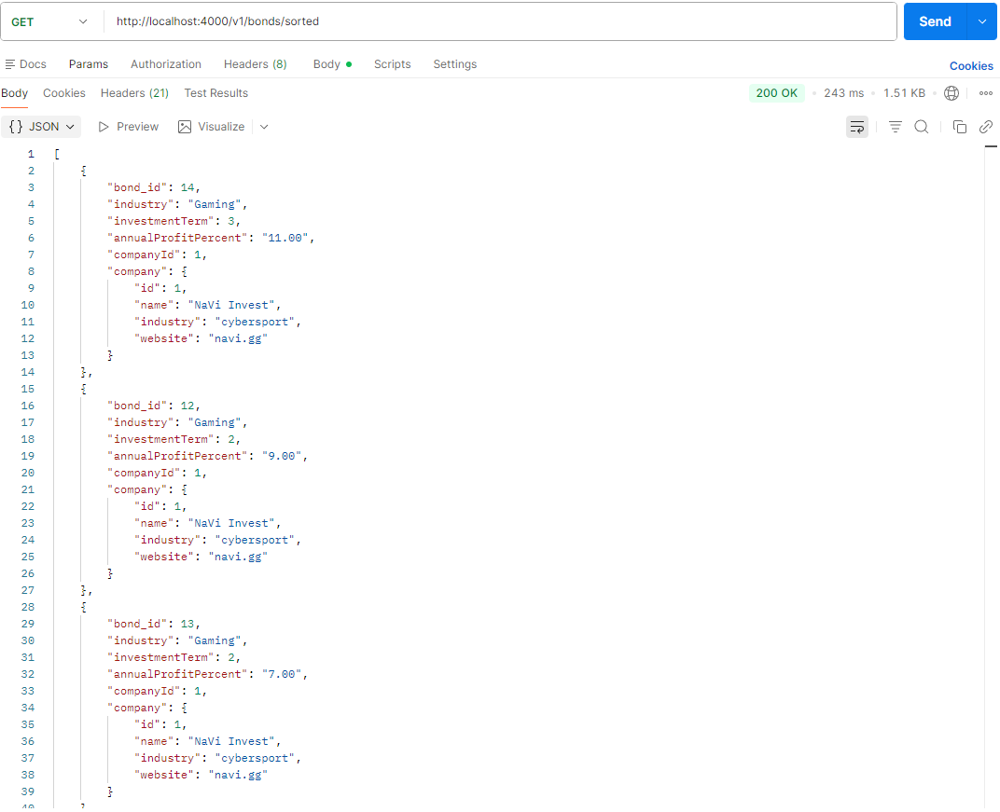
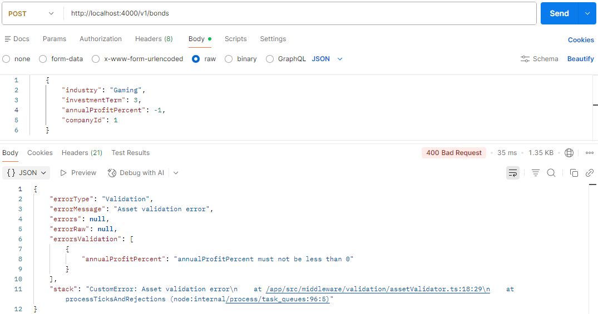
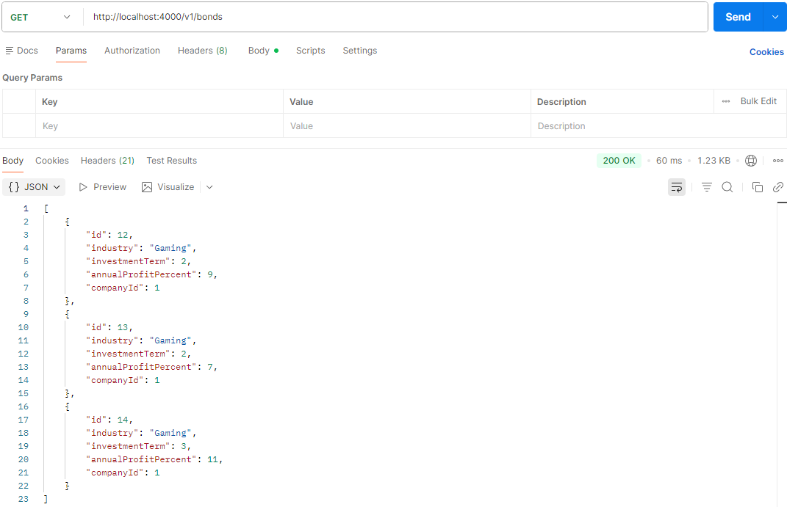

# Лабораторно-практична робота №5

## Розширення бекенд-додатку власними сутностями та реалізація REST API
### Мета
Розвинути навички проектування та реалізації серверної логіки, інтегрувавши проєкт бази даних з курсової роботи у повноцінний бекенд-додаток. Навчитись створювати пов'язані сутності за допомогою TypeORM, керувати структурою БД через міграції та будувати REST API для роботи з реляційними даними.

## 1. Короткий опис реалізованих сутностей та їхніх зв'язків
Company (Компанія) - головна сутність, має свої акції та облігації.

Bond (Облігація) - фінансовий актив, прив'язаний до конкретної компанії.

Action (Акція) - фінансовий актив, прив'язаний до конкретної компанії.

Різниця в акціях та облігаціях в їх полях та тому як вони працюють в інвест компанії.

## 2. Перелік реалізованих API ендпоінтів
### Управління компаніями
GET /companies - Отримати список усіх компаній зі звітами по активах.

GET /companies/:id - Детальна інформація про конкретну компанію та активи, що вона пропонує.

POST /companies - Реєстрація нової інвестиційної компанії.

PATCH /companies/:id - Оновлення даних компанії.

DELETE /companies/:id - Видалення компанії (заблоковано, якщо є активи, спочатку треба видалити їх).

### Управління облігаціями
GET /bonds - Список усіх облігацій у системі.

POST /bonds - Створення нової облігації з прив'язкою до companyId.

PATCH /bonds/:id - Редагування параметрів.

DELETE /bonds/:id - Видалення облігації.

### Управління акціями
GET /actions - Список усіх доступних акцій.

POST /actions - Додавання нової акції.

PATCH /actions/:id - Оновлення акції.

DELETE /actions/:id - Видалення акції з бази.

## 3. Скріншоти з Postman
### Компанії
Створення нової компанії


Список усіх компаній та активів, що вони пропонують


Переглянути компанію за id та активи, що вона пропонує


Оновити компанію


Видалити компанію


### Облігації
Додати нову облігацію


Список усіх облігацій


Оновити облігацію за id


Видалити облігацію за id


### Акції
Додати нову акцію


Список усіх акцій


Оновити акцію за id


Видалити акцію за id


# Лабораторно-практична робота №6

## Впровадження сервісного шару, валідації та DTO
### Мета
Навчитись проектувати та реалізовувати правильну архітектуру бекенд-додатку за принципом розділення відповідальності (Separation of Concerns). Практично реалізувати сервісний шар, впровадити механізм валідації через middleware та навчитись формувати контрольовані відповіді API за допомогою DTO.

## 1. Пояснити роль кожного шару: Middleware (валідація), Controller (оркестрація), Service (бізнес-логіка), Repository (доступ до даних).

Middleware (Валідація): Перевіряє вхідні дані до того, як вони потраплять у контролер. Якщо дані не валідні, то middleware зупиняє запит і повертає 400 Bad Request.

Controller (Оркестрація): Приймає HTTP-запит, викликає потрібний метод у Service і повертає результат клієнту через DTO.

Service (Бізнес-логіка): Виконує розрахунки, наприклад, якщо ми купуємо акції, сервіс ділить внесені гроші на ціну одного пакету акцій і розраховує яку кількість акцій отримає інвестор за ті гроші, що він вніс.

Repository (Доступ до даних): Шар, який безпосередньо спілкується з базою даних через TypeORM.

## 2. Наведіть приклад коду вашої middleware-функції.

### Код файлу assetValidarot.ts

```assetValidarot.ts
import { Request, Response, NextFunction } from 'express';
import { plainToInstance } from 'class-transformer';
import { validate, ValidationError } from 'class-validator';

import { CustomError } from 'utils/response/custom-error/CustomError';
import { ErrorValidation } from 'utils/response/custom-error/types';

export const assetValidator = (dtoClass: any) => {
  return (req: Request, res: Response, next: NextFunction) => {
    const output = plainToInstance(dtoClass, req.body);
    
    validate(output).then((errors: ValidationError[]) => {
      if (errors.length > 0) {
        const errorsValidation: ErrorValidation[] = errors.map((error) => ({
          [error.property]: Object.values(error.constraints || {}).join(', '),
        }));

        const customError = new CustomError(
          400, 
          'Validation', 
          'Asset validation error', 
          null, 
          null, 
          errorsValidation
        );
        return next(customError);
      }
      
      req.body = output;
      return next();
    });
  };
};
```
### Перевірка усіх декораторів, що прописані в файлі Asset.dto.ts

```assetValidarot.ts
    validate(output).then((errors: ValidationError[]) => {
      if (errors.length > 0) {
        const errorsValidation: ErrorValidation[] = errors.map((error) => ({
          [error.property]: Object.values(error.constraints || {}).join(', '),
        }));

        const customError = new CustomError(
          400, 
          'Validation', 
          'Asset validation error', 
          null, 
          null, 
          errorsValidation
        );
        return next(customError);
      }
      
      req.body = output;
      return next();
    });
```
### Формування зрозумілої помилки

```assetValidarot.ts
const errorsValidation: ErrorValidation[] = errors.map((error) => ({
  [error.property]: Object.values(error.constraints || {}).join(', '),
}));
```
### Виклик помилки

```assetValidarot.ts
        const customError = new CustomError(
          400, 
          'Validation', 
          'Asset validation error', 
          null, 
          null, 
          errorsValidation
        );
        return next(customError);
```


### Код файлу Asset.dto.ts

```Asset.dto.ts
import { IsString, IsNumber, IsNotEmpty, Min, IsOptional } from 'class-validator';

export class CreateCompanyDto {
  @IsString()
  @IsNotEmpty()
  name: string;

  @IsString()
  @IsNotEmpty()
  industry: string;

  @IsString()
  @IsOptional()
  website: string;
}

export class CreateActionDto {
  @IsString()
  @IsNotEmpty()
  name: string;

  @IsString()
  @IsNotEmpty()
  industry: string;

  @IsNumber()
  @Min(0.01)
  price: number;

  @IsNumber()
  @IsNotEmpty()
  companyId: number;
}

export class CreateBondDto {
  @IsString()
  @IsNotEmpty()
  industry: string;

  @IsNumber()
  @Min(1)
  investmentTerm: number;

  @IsNumber()
  @Min(0)
  annualProfitPercent: number;

  @IsNumber()
  @IsNotEmpty()
  companyId: number;
}
```

## 3. Наведіть приклад коду вашого ResponseDTO та сервіс-класу.

### Приклад коду ResponseDTO (BondResponse.dto.ts)

```BondResponse.dto.ts
import { Bond } from '../orm/entities/Bond.entity';

export class BondResponseDTO {
  id: number;
  industry: string;
  investmentTerm: number;
  annualProfitPercent: number;
  companyId: number;

  constructor(bond: Bond) {
    this.id = bond.bond_id;
    this.industry = bond.industry;
    this.investmentTerm = bond.investmentTerm;
    this.annualProfitPercent = Number(bond.annualProfitPercent); 
    this.companyId = bond.companyId;
  }
}
```

### Приклад коду сервіс-класу (BondService.ts)
#### Повертає відсортовані облігації за відсотком річного прибутку

```BondService.ts
  async findAllSorted(): Promise<Bond[]> {
    return await this.bondRepository.find({
      order: {
        annualProfitPercent: 'DESC'
      },
      relations: ['company']
    });
  }
```



## 4. Додайте скріншоти з Postman:

### 1. Запит з некоректними даними, який повертає помилку 400 Bad Request від вашого middleware.


### 2. Успішний запит, відповідь на який має структуру вашого нового ResponseDTO.

